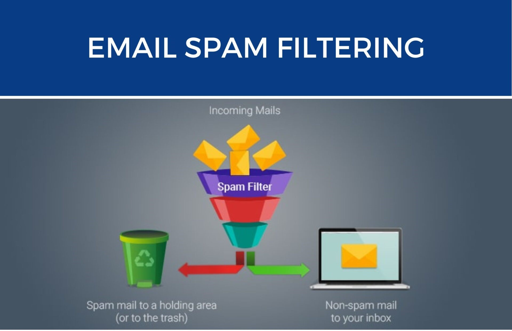

# Spam Classifier
----
### Problem Statement
#### Create a binary classifier that will able to detect the whether entered text is spam or ham (not spam)

### Objective
#### The objective of this project is to create spam classifier that will help to automate the task in term of classification of spam text , email , messages

#### How to start with project

```
conda create -p venv python=3.8
```

After Creating Virtual Enviournment

```
conda activate enviornemt_name
```

#### Requirements of this project
1. python version 3.8
2. conda
3. sklearn
4. flask

### Conclusion

### Result

